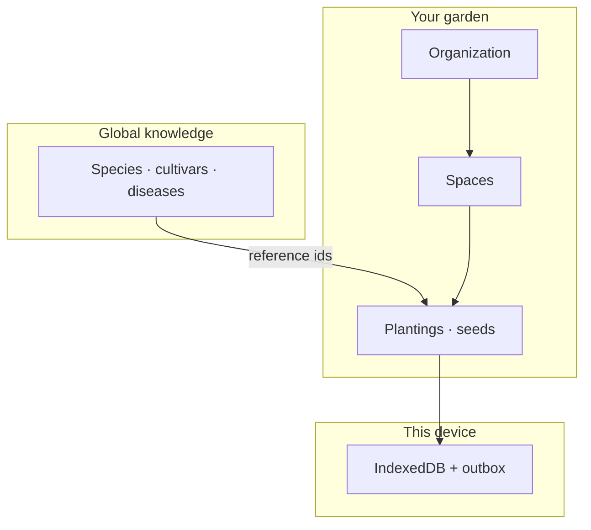

# OGOROD

**The garden in your pocket.** An offline-first PWA for tracking plants, spaces, seeds, weather, and care — on a phone in the field, then synced when you are back online.

[](https://github.com/AlexandrGezerdavaDev/ogorod/actions/workflows/ci.yml)
[](https://nextjs.org/)
[](https://www.typescriptlang.org/)
[](LICENSE)

OGOROD is designed for small gardens: a greenhouse, a balcony, a few beds. One codebase runs as a hosted app or a self-hosted stack.

Ukrainian, English, and Russian UI.

---

## What you can do today

| Area | Status |
| --- | --- |
| Sign up, sign in, garden (organization) | Done |
| Spaces (greenhouse, beds, balcony…) — create, rename, filter plants | Done |
| Plantings — add, delete, species catalog, watering / feeding checkboxes | Done |
| Seed lots — inventory, packing date, quantity | Done |
| Weather for the garden location (Open-Meteo) | Done |
| Install as a PWA, work offline, sync when online | Done |
| Camera capture | Photo saved; plant ID is not wired yet |
| Care calendar | Demo tasks; live scheduling comes later |
| Observations, harvests, photos on the server | Schema & sync exist; no UI yet |

---

## Why offline-first

A garden is a poor place for a flaky connection. Writes go to **IndexedDB (Dexie)** on the device first, then into an **outbox**. When the network is back, the client pushes changes and pulls the rest of the garden.

Three kinds of data stay separate:



- **Knowledge base** — one shared catalog for everyone (`Solanum lycopersicum` is not copied per garden). Clients pull catalog diffs by revision.
- **Tenant** — your garden: spaces, plantings, seed lots. Rows are versioned; conflicts use optimistic concurrency.
- **Device** — local cache, outbox, sync cursor. After a successful sync, PostgreSQL is the source of truth.

Details: [docs/architecture.md](docs/architecture.md).

---

## Stack

| Layer | Choice |
| --- | --- |
| App | [Next.js](https://nextjs.org/) 16, React 19, TypeScript |
| UI | [shadcn/ui](https://ui.shadcn.com/), Tailwind CSS 4 |
| Auth | [Better Auth](https://www.better-auth.com/) (email / password, organizations) |
| Server DB | PostgreSQL 16, [Drizzle ORM](https://orm.drizzle.team/) |
| Client DB | [Dexie](https://dexie.org/) (IndexedDB) |
| Sync | Push/pull API, OCC, `farm_change` cursor (not client clocks) |
| Weather | [Open-Meteo](https://open-meteo.com/) |
| Run | Docker Compose (Postgres; Redis & MinIO reserved for later) |

---

## Quick start

**Needs:** Docker, Node.js 22+.

```bash
git clone https://github.com/AlexandrGezerdavaDev/ogorod.git
cd ogorod
cp .env.example .env
```

Set `BETTER_AUTH_SECRET` in `.env` (for example `openssl rand -base64 32`). Do not commit `.env`.

```bash
docker compose up -d postgres redis minio
npm install
npm run db:migrate
npm run db:seed
npm run dev
```

Open [http://localhost:3000](http://localhost:3000) and create an account. Signup also creates a garden named **My garden**.

The seed catalog currently adds one taxon for the whole system (not per user): tomato / *Solanum lycopersicum*, cultivar Oxheart.

---

## Scripts

| Command | Purpose |
| --- | --- |
| `npm run dev` | Next.js dev server |
| `npm run build` | Production build |
| `npm run db:up` | Postgres only |
| `npm run db:generate` | New SQL migrations from the Drizzle schema |
| `npm run db:migrate` | Apply migrations |
| `npm run db:seed` | Knowledge-base seed |
| `npm run db:studio` | Drizzle Studio |
| `npm run typecheck` | `next typegen` + `tsc --noEmit` |
| `npm run lint` | ESLint |

---

## Self-host

Same repo and image. Bring up Postgres, migrate and seed, then the full stack:

```bash
cp .env.example .env
# fill BETTER_AUTH_SECRET and the other secrets
docker compose up -d postgres redis minio
npm run db:migrate
npm run db:seed
docker compose --profile full up -d
```

That starts Postgres, Redis, MinIO, and the app on port 3000. Put TLS in front with your own reverse proxy (Caddy, nginx, …).

---

## Environment

Copy [`.env.example`](.env.example). Important variables:

| Variable | Role |
| --- | --- |
| `DATABASE_URL` | PostgreSQL |
| `BETTER_AUTH_SECRET` | Session signing (required, ≥ 32 characters) |
| `BETTER_AUTH_URL` | Auth base URL |
| `NEXT_PUBLIC_APP_URL` | Public app URL |
| `REDIS_URL` | Reserved |
| `S3_*` | Reserved for photo upload |

Secrets never belong in Git. `.env` is gitignored; only `.env.example` is tracked.

---

## Project layout

```
src/
  app/             Routes, API (auth, sync, weather, catalog)
  components/      App shell, plants, seeds, spaces, UI
  db/              Drizzle schema, migrations, seed
  features/        Farm, sync engine, weather, i18n helpers
  i18n/            uk · en · ru
docs/architecture.md
drizzle/           SQL migrations
```

---

## Roadmap (short)

- Plant recognition from the camera
- Live care calendar from plantings and weather
- Observation and harvest UI
- Photo storage (MinIO)
- OAuth and real email delivery

---

## License

[MIT](LICENSE) © 2026 Alexandr Gezerdava
